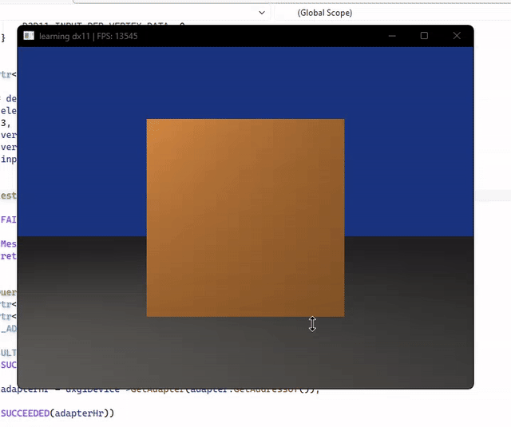

# Sei

A C++ game engine project I am building to learn 3D graphics programming with DirectX 11 and engine architecture.

## Demo



## Current architecture

```text
.
├── README.md
├── .gitignore
├── Application.slnx         Visual Studio solution
├── Demo/
│   └── demo.gif
└── Application/
    ├── Application.vcxproj  Visual Studio C++ project
    ├── main.cpp             Startup and application loop
    ├── Sei/
    │   ├── Window/          Win32 window handle/messages
    │   └── Render/          DX11 initialization/helpers
    └── Resources/
        └── Models/
```
