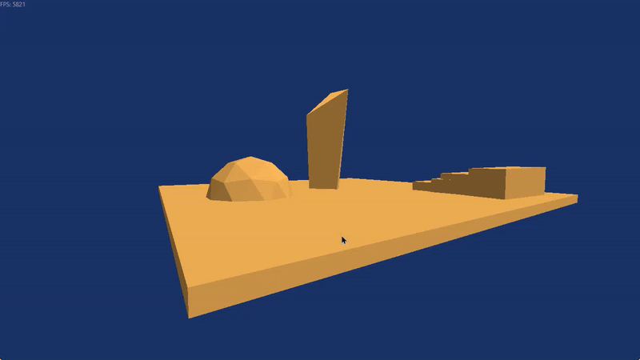

# Sei

A C++ game engine project I am building to learn 3D graphics programming with DirectX 11 and engine architecture.

## Demo

**Current preview 2026-10-08:** Able to load dummy Blender map, write FPS, toggle wireframe with F2, and a lot more. Maintains around ~4000 FPS.



**Old preview**: Shader experimentation, hard-coded cube


## Current architecture

```text
.
├── Application.slnx
└── Application/
    ├── Application.vcxproj 
    ├── main.cpp             startup / application loop
    ├── Sei/
    │   ├── Window/          Win32 window creation, messages
    │   ├── Input/           key/mouse capture
    │   ├── Camera/          camera matrices, free-camera movement
    │   ├── AssetLoader/     OBJ parsing, GLB scene loading (with cgltf)
    │   ├── Render/          everything DX11 (meshes, shaders, etc.) 
    │   └── HUD/             basic stylized text rendering
    ├── Game/                everything game-specific
    ├── Resources/
    │   ├── Maps/            GLB scenes
    │   ├── Models/          OBJ models
    │   └── Shaders/         HLSL shaders
    └── ThirdParty/
        └── cgltf/          Vendored glTF/GLB parser
```
